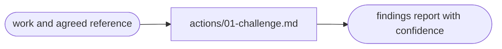

# Challenge

```mermaid
flowchart LR
  work([work and agreed reference]) --> challenge["actions/01-challenge.md"]
  challenge --> report([findings report with confidence])
```

## Transversal rules

- Reason from first principles, no logical gaps.
- Aim for simplifications: if the work can be smaller, say so.
