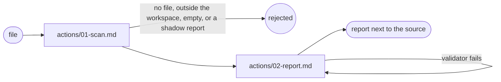

# Shadow Areas

```mermaid
flowchart LR
  source([file]) --> scan["actions/01-scan.md"]
  scan -->|"no file, outside the workspace, empty, or a shadow report"| rejected((rejected))
  scan --> report["actions/02-report.md"]
  report -->|"validator fails"| report
  report --> done([report next to the source])
```

## Transversal rules

- Never modify the source.
