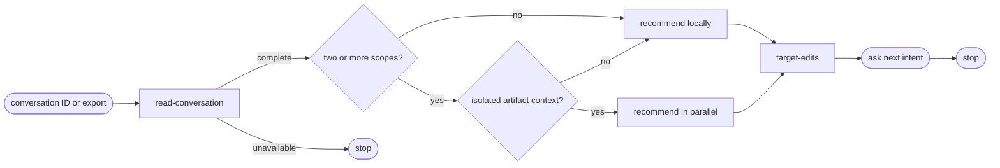

# Improve

## Actions

Run the flow above. Read only the next action file.

| Action | Does |
| --- | --- |
| read-conversation | freeze complete evidence and measure visible cost |
| recommend | analyze relevant scopes and merge grounded findings |
| target-edits | render minimal edits and an executable prompt |

## Transversal rules

- After resolving the source, run all three actions without pausing for confirmation.
- Analyze only a complete conversation and the exact skills or documents it names.
- Exclude every current or previous `improve` invocation and report from the analysis evidence.
- Never invent time, tokens, source coverage, or document status.
- Do not modify, stage, or persist any project file.
