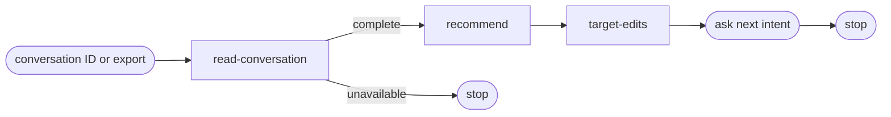

# Improve

## Actions

Run the flow above. Read only the next action file.

| Action | Does |
| --- | --- |
| read-conversation | load complete evidence and profile its cost |
| recommend | answer every improvement question with evidence |
| target-edits | map recommendations to minimal file edits and ask for the next intent |

## Transversal rules

- After resolving the source, run all three actions without pausing for confirmation.
- Analyze only a complete conversation and the exact skills or documents it names.
- Exclude every current or previous `improve` invocation and report from the analysis evidence.
- Never invent time, tokens, source coverage, or document status.
- Do not modify, stage, or persist any project file.
