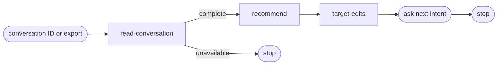

# Improve

```mermaid
flowchart LR
  start([conversation ID or export]) --> read-conversation
  read-conversation -->|complete| recommend --> target-edits
  read-conversation -->|unavailable| unavailable([stop])
  target-edits --> question([ask next intent]) --> stop([stop])
```

## Actions

Run all three actions in order without confirmation. Read only the next file in `actions/`.

| Order | Action |
| --- | --- |
| 1 | `01-read-conversation.md` |
| 2 | `02-recommend.md` |
| 3 | `03-target-edits.md` |

## Transversal rules

- Locate conversation data through [conversation sources](assets/conversation-sources.md); access only the selected conversation and its relevant sources.
- Use recorded evidence only; mark unavailable measurements as such.
- Keep project files read-only; write only a unique temporary report.
