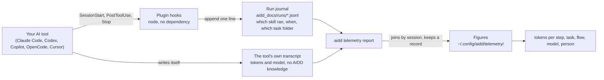

← [aidd-framework](../../README.md)

# aidd-telemetry

Know what a piece of work cost: which skill, which step and which task spent the tokens.

> Status: beta. Proven end to end on Claude Code; the other four tools are covered to the
> extent their own files allow. Off the curated install path until it has run on other
> people's machines.

## What it is

Your provider can tell you a developer burned four million tokens on Tuesday. This plugin
tells you which skill spent them, on which task.

```text
period    2026-08-21 to 2026-08-21

  sessions                  1
  requests                  3
  tokens                    116,678    80% cache
  cost                      amount unknown

  by step    of tokens
    aidd-ui:01-hello           67%   78,188 tokens    stated by the tool
    aidd-ui:01-hello           33%   38,490 tokens    from a journal interval
```

Every figure says how it was attributed. `stated by the tool` is exact, `from a journal
interval` is an inference, `unattributed` means neither source could say — never "no step
ran". An unknown is named, never shown as a zero, and no figure is in currency: pricing
tokens is a separate service's job.

## Why it exists

A provider meters an account. Only the framework knows its own units of work — the skill,
the step, the task, the flow — so only it can say what one piece of work cost.

Three things it never does: it never sends anything anywhere, it never stores a prompt, a
diff or a line of code, and it never records until you turn it on.

## How it works

Two sources exist already. The plugin adds the one thing that joins them.



- **The hooks journal.** Every session appends one line per observation to
  `aidd_docs/runs/<run_id>__<vendor_id>.jsonl`, git-ignored, never rewritten. No token, no
  cost, no model lands there.
- **Your tool writes its own transcript**, in its own place and format. It holds the tokens
  and knows nothing about skills.
- **`aidd telemetry report` joins the two**, by session, and keeps the result under
  `~/.config/aidd/telemetry/`. The join cannot happen live: when a hook fires, the tokens
  for that turn are not written yet.

Recording depends on nothing but `node`, so a session is measured whether or not `aidd` is
installed. Allowing and answering go through the CLI, so the figure is computed once.

## Getting started

```sh
npm install -g @ai-driven-dev/cli
aidd plugin install aidd-telemetry
```

Then ask your AI tool for a skill. Each one stops with the reason if `aidd` does not answer,
rather than reporting an empty figure.

| Ask your tool for | It runs | You get |
| --- | --- | --- |
| `00-init` | `aidd telemetry on`, then `check` | measurement allowed for this project, and proof the switch took |
| `01-cost` | `aidd telemetry report` | what a period or one task consumed, by step, model, task, flow, tool or person |
| `02-check` | `aidd telemetry check` | whether the chain is actually recording, and what to fix if not |

## Coverage

| Tool | Tokens | Step | Task |
| --- | --- | --- | --- |
| **Claude Code** | ✅ proven on live sessions | ✅ stated by the tool, and by interval | ✅ |
| **Codex** | ✅ on captured rollouts | ✅ by interval | ✅ |
| **OpenCode** | ✅ | ✅ through its own plugin API | ✅ |
| **Copilot** | ⚠️ session total only, no per-request figure (one cumulative total at shutdown) | ✅ by interval | ✅ |
| **Cursor** | ❌ no token count in any file it writes | ✅ | ✅ |

A limit a reader has to look up gets read as a zero, so each one is named here:

- **Codex needs one interactive approval.** Its hook trust is per entry and a headless run
  never sees the prompt, so a Codex session journals nothing until someone approves once.
- **OpenCode never announces a session, so the plugin opens it.** `session.created` is
  published on its bus but never reaches the hook, so the first call a session produces
  opens it, under the directory that call was going to use. What is lost: on a server
  serving several directories, a session it never announced is
  journalled under the plugin's own init-time directory.
- **These are raw counters, not your tool's usage screen.** A vendor's page weights a cached
  token by what it charges for it; these are the counts the tool wrote down. The two
  disagree on cache lines by construction, and neither is wrong.
- **A period means when the work ran**, not when it was billed, and nothing reconstructs
  work done before you turned measurement on.

## Privacy

- **Nothing leaves the machine.** Every code path that once could is deleted. On a machine
  where an older version configured an export endpoint, `aidd telemetry check` and
  `aidd telemetry off` both detect it and name what to remove by hand.
- **No prompt, no code, no diff.** The stored shape is an allowlist, field by field, in
  [the record contract](../../aidd_docs/product/metrics-contract.md).
- **The switch is a file you commit or do not**, per project (`.aidd/config.json`). Once
  committed on, it applies to everyone who clones. Refuse it for yourself alone with
  `AIDD_TELEMETRY=0`, which overrides the file unconditionally.
- **`off` keeps what you measured**; `aidd telemetry forget` removes it — this project's
  journal, this machine's records and its identity file — and removes nothing without
  `--yes`.
- **Your identity is yours to attach**, through `aidd telemetry identity`. To share figures
  across a team, point `AIDD_TELEMETRY_DIR` at a shared directory — never
  `AIDD_USER_CONFIG_DIR`, which also relocates `auth.json` and its GitHub token.

## Where things are written down

- [`aidd_docs/runs/README.md`](../../aidd_docs/runs/README.md): what the journal records,
  and what it deliberately does not.
- [`cost-report-contract.md`](../../aidd_docs/product/cost-report-contract.md): the object
  `report --json` prints, and the `backlog-link.json` a task folder may carry to say which
  backlog item it delivers.
- [`metrics-contract.md`](../../aidd_docs/product/metrics-contract.md): one stored line, for
  a service that prices them.
