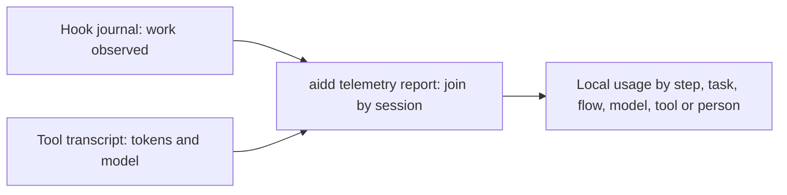

← [aidd-framework](../../README.md)

# aidd-telemetry

Understand token usage by skill and task to improve workflows.

## Getting started

Recording requires only `node`; enabling and reporting require `aidd`.

```sh
npm install -g @ai-driven-dev/cli
aidd plugin install aidd-telemetry
```

Enable measurement, work in a session, then report and verify. Use skills or CLI commands;
skills stop and explain when `aidd` cannot answer.
Report after the turn: hooks fire before its tokens are durably written.

| Ask your tool for | It runs | You get |
| --- | --- | --- |
| `00-init` | `aidd telemetry on`, then reads a run file back | project opt-in and recording proof |
| `01-cost` | `aidd telemetry report` | period or task usage |
| `02-check` | `aidd telemetry check` | recording status and required repairs |

## Reading a report

### Report construction

AIDD connects provider counts to units of work.


```mermaid
flowchart LR
  Journal["Hook journal: work observed"] --> Report["aidd telemetry report: join by session"]
  Transcript["Tool transcript: tokens and model"] --> Report
  Report --> Results["Local usage by step, task, flow, model, tool or person"]
```

Tools write their own transcripts without AIDD skill knowledge. Reports join these with
hook observations by session.

### Result interpretation

Usage groups: step, model, task, flow, tool and person. Attribution states its evidence:

- `stated by the tool`: exact attribution.
- `from a journal interval`: inferred attribution.
- `unattributed`: neither source identifies a step; it does not mean no step ran.
- **Unknown values** remain unknown, never zero.
- **Counts** are raw tokens, not currency; a separate service prices them. Vendor usage
  screens weight cached tokens by price, so different counts do not mean either is wrong.
- **Periods** reflect work time, not billing time. Activity before opt-in cannot be reconstructed.

## Coverage

> Beta. Proven end to end on Claude Code; other tools depend on their recorded data.
> Excluded from curated installation pending validation on other users' machines.

| Tool | Tokens | Step | Task |
| --- | --- | --- | --- |
| **Claude Code** | ✅ proven on live sessions | ✅ stated by the tool, and by interval | ✅ |
| **Codex** | ✅ on captured rollouts | ✅ by interval | ✅ |
| **OpenCode** | ✅ | ❌ no skill call reaches its plugin | ✅ |
| **Copilot** | ⚠️ session total only, no per-request figure (cumulative at shutdown) | ✅ by interval | ✅ |
| **Cursor** | ❌ no token count in any file it writes | ✅ | ✅ |

- **Codex:** approve each hook entry interactively. Headless runs cannot show the trust
  prompt; sessions record nothing until approval.
- **OpenCode:** supports V1 ≥ 1.18.29 and V2; older V1 lacks the default plugin definition.
  OpenCode V1 can omit the session announcement; the first journalable event then opens it.
  Without a known session directory, it uses the plugin's startup directory, which can be
  wrong for a server serving several projects.
  V2 supplies session directories and journals tool and execution completions through its
  event subscription.
- **OpenCode steps:** only task paths reach the journal, never skill calls. Every request
  remains unattributed by step.

## Data and privacy

### Stored data

Recording is local and opt-in, with no export, prompts, code or diffs. Hooks append one
line per observation to git-ignored `aidd_docs/runs/<run_id>__<vendor_id>.jsonl`, never
rewriting it or recording tokens, cost or model. Joined measurement records are stored under
`~/.config/aidd/telemetry/` according to [the record contract](../../aidd_docs/product/metrics-contract.md).

### Privacy controls

- **Project opt-in:** committing `.aidd/config.json` with measurement enabled affects all
  clones. `AIDD_TELEMETRY=0` unconditionally overrides it for yourself.
- **Retention:** `off` keeps records. `aidd telemetry forget` removes the project's journal,
  this machine's records and identity file; deletion requires `--yes`.
- **Legacy exports:** `aidd telemetry check` and `aidd telemetry off` detect old endpoints
  and identify required manual removal.
- **Identity:** attach it optionally through `aidd telemetry identity`. Share figures using
  `AIDD_TELEMETRY_DIR`, never `AIDD_USER_CONFIG_DIR`: the latter also relocates `auth.json`
  and its GitHub token.

## Reference contracts

- [`aidd_docs/runs/README.md`](../../aidd_docs/runs/README.md): journal contract.
- [`cost-report-contract.md`](../../aidd_docs/product/cost-report-contract.md): the object
  printed by `report --json`; optional `backlog-link.json` maps a task to its backlog item.
- [`metrics-contract.md`](../../aidd_docs/product/metrics-contract.md): stored records for pricing.
