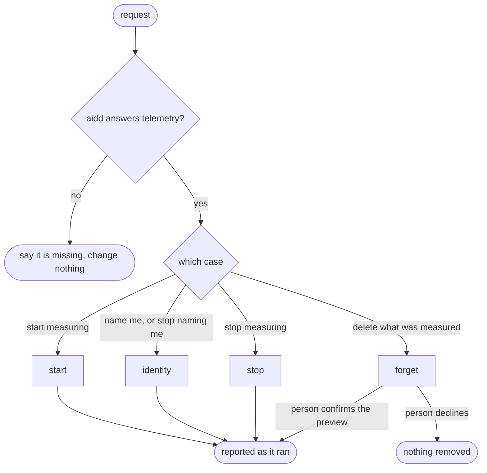

# Init

## Actions

Run the flow above. Read only the action file the case needs.

| Action | Does |
| --- | --- |
| start | ask for consent, then turn measurement on for this project |
| identity | set, show or remove the name on the person's own measurement |
| stop | turn measurement off for this project, keeping what was measured |
| forget | preview, then on confirmation delete everything measured on this machine |

## Transversal rules

- Probe first. Run `aidd telemetry --help` before any action. When `aidd` is not found, or the command exits non-zero, stop and say plainly that `aidd` is missing or too old to measure, name `@ai-driven-dev/cli` as what to install or update, and state that nothing was changed. Never go on, and never answer as if it had worked.
- Every change goes through `aidd telemetry`. Never edit git config, `.aidd/config.json` or any file by hand.
- Never run a command that changes anything before the person has said yes to what it does. A silence, a previous yes to another case, or a standing instruction is not a yes.
- Report what each command printed, including every warning, and never claim a result the output did not show.
- Never choose, derive or guess a name for the person: not from git, from the machine, nor from the session.
- When a command exits non-zero, show its message and stop. Do not retry with other flags.
