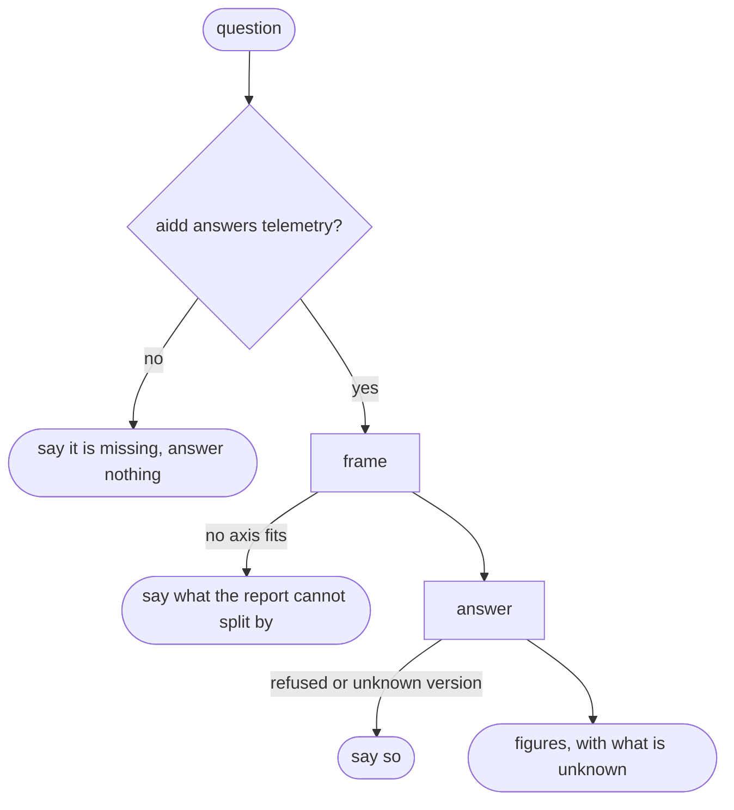

# Usage

## Actions

Run the flow above. Read only the next action file.

| Action | Does |
| --- | --- |
| frame | map the question to a period and one axis, and name the command |
| answer | run it, read the JSON, and state the figures with what is unknown |

## Transversal rules

- Probe first. Run `aidd telemetry --help` before any action. When `aidd` is not found, or the command exits non-zero, stop and say plainly that `aidd` is missing or too old to report, name `@ai-driven-dev/cli` as what to install or update, and state that no figure is available. Never answer from memory, from the session, or from anything but the report.
- Every figure comes from `aidd telemetry report --json`. Never add, subtract, average, convert or estimate a number, and never turn tokens into money: the report holds counts only.
- Keep input, output, cache read and cache write apart. A total is the report's own `total`, not a sum made here.
- An unknown is unknown, never zero. Say so whenever the report shows one.
- Read only. Nothing here declares a task, turns measurement on, or changes any file.
