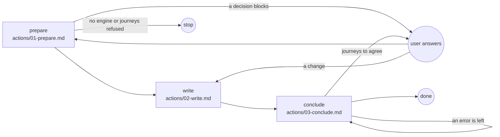

# Journeys

## Actions

```mermaid
flowchart LR
  prepare["prepare<br>actions/01-prepare.md"] --> write["write<br>actions/02-write.md"]
  write --> conclude["conclude<br>actions/03-conclude.md"]
  prepare -->|"a decision blocks"| user((user answers))
  user --> prepare
  conclude -->|"an error is left"| conclude
  conclude -->|"journeys to agree"| user
  user -->|"a change"| write
  conclude --> done((done))
  prepare -->|"no engine or journeys refused"| stop((stop))
```

Each box is a file: read it, then do what it says.

## Transversal rules

- Speak only to ask or to give the final reply.
- Write each question, option and label in the person's language.
- Ask with a concrete proposal, unless nothing describes the product.
- Never offer an option that only says to type an answer.
- After asking, wait for the answer.
- Name a record by its title and a state by its label.
- Say what the person will see, in their words.
- Never show a path, file name, id, rule code or size.
- Never show a version number, skill name, history or changelog.
- Never give a unit, or a count of warnings.
- Never use jargon: no wireframe, design system, token or hex code. Say what it is.
- Name a step by what it does, never by its skill name.
- Name the showcase plainly, « la vitrine » in French.
- Say once how to open it: double-click `index.html` in `aidd_docs/ui/showcase/`. Give no other path.
- To show a page, point to it in the showcase.
- Never hand over a capture or a temp file.
- End a reply with exactly one next step or one question. Hold the others.
- Otherwise call tools.
- Run the engine from the project root; never read its source.
- Write only under `aidd_docs/ui/journeys/` and `aidd_docs/ui/wireframes/`.
- After each write, fix what the hook or the validation reports.
- Never bypass a hook.
- Record the history without asking. Change only what was named, and never offer more.
- Saving means writing the design files. Never branch, commit or push unless the person asks for git.
