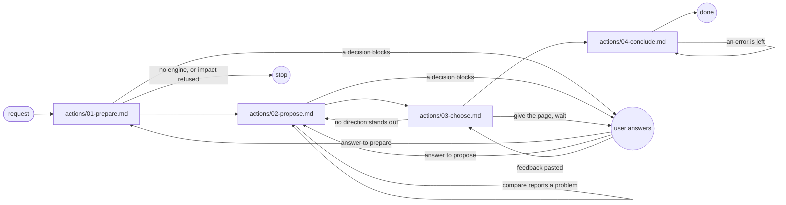

# Logo

```mermaid
flowchart LR
  prepare["actions/01-prepare.md"]
  propose["actions/02-propose.md"]
  choose["actions/03-choose.md"]
  conclude["actions/04-conclude.md"]
  entry([request]) --> prepare
  prepare --> propose
  prepare -->|"a decision blocks"| user((user answers))
  prepare -->|"no engine, or impact refused"| stop((stop))
  propose --> choose
  propose -->|"a decision blocks"| user
  propose -->|"compare reports a problem"| propose
  choose --> conclude
  choose -->|"give the page, wait"| user
  choose -->|"no direction stands out"| propose
  user -->|"answer to prepare"| prepare
  user -->|"answer to propose"| propose
  user -->|"feedback pasted"| choose
  conclude -->|"an error is left"| conclude
  conclude --> done((done))
```

## Transversal rules

- Write only the `logo-` files under `aidd_docs/ui/assets/` and the set under `aidd_docs/ui/drafts/logo/`.
- Never write in the code.
