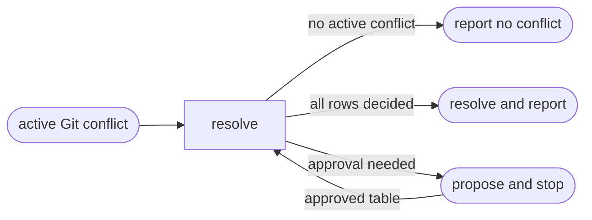

# Resolve Conflict

```mermaid
flowchart LR
  start([active Git conflict]) --> resolve
  resolve -->|no active conflict| none([report no conflict])
  resolve -->|all rows decided| applied([resolve and report])
  resolve -->|approval needed| proposal([propose and stop])
  proposal -->|approved table| resolve
```

## Actions

Read only the next action file.

| Action | Does |
| ------ | ---- |
| resolve | resolve conflicts or propose choices |

## Transversal rules

- Change only what the decided conflict resolutions require; preserve all other content and index entries.
- Stop after staging and validation. Do not commit, continue, abort, or switch branches.
- Stage only files resolved by this skill, never unrelated files.
