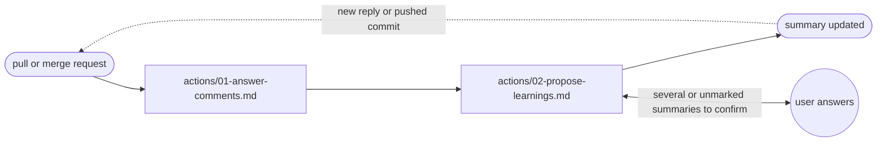

# Answer Comments

```mermaid
flowchart LR
  request([pull or merge request]) --> answer["actions/01-answer-comments.md"]
  answer --> learn["actions/02-propose-learnings.md"]
  learn --> summary([summary updated])
  learn <-->|"several or unmarked summaries to confirm"| user((user answers))
  summary -.->|new reply or pushed commit| request
```

## Transversal rules

- Reach the pull or merge request through the VCS tool `aidd_docs/memory/vcs.md` names, else the one the remote points to.
- Never modify source, commit, push, or merge the request.
