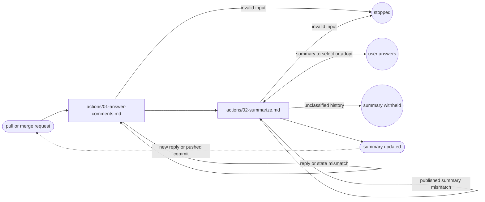

# Answer Comments

```mermaid
flowchart LR
  request([pull or merge request]) --> answer["actions/01-answer-comments.md"]
  answer -->|"invalid input"| stopped((stopped))
  answer -->|"reply or state mismatch"| answer
  answer --> summarize["actions/02-summarize.md"]
  summarize <-->|"summary to select or adopt"| user((user answers))
  summarize -->|"unclassified history"| incomplete((summary withheld))
  summarize -->|"invalid input"| stopped
  summarize -->|"published summary mismatch"| summarize
  summarize --> done([summary updated])
  done -.->|"new reply or pushed commit"| request
```

## Transversal rules

- Reach the pull or merge request through the VCS tool `aidd_docs/memory/vcs.md` names, else the one the remote points to.
- Read code and history as evidence.
- Leave filtering, counts, summary selection and rendering to `scripts/prepare-review.cjs`.
- Never modify source, commit, push, or merge the request.
