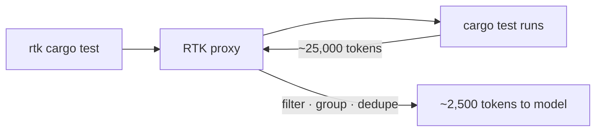

# Token optimization for AI IDEs

Cut token usage and cost in AI coding assistants without losing output quality.

## Why optimize your tokens

**Token usage** is the bill — every turn re-sends your whole **context window** and you pay for it again.

Most of it is **waste**: filler prose, noisy logs, stale context, bloated instruction files.

Reach for this recipe when **cost** climbs faster than your output.

## Steps to cut token usage

### 🟢 Beginner

#### 1) 🔎 See what fills the window — `/context`

`/context` paints your context as a grid, so you cut the biggest consumers instead of guessing.

1. Run `/context` in Claude Code.
2. Find the heavy blocks: tool schemas, instruction files, long file reads.
3. Attack the biggest block first.

```text
$ /context
  MCP tool schemas   ████████████  28%   ← biggest, cut first
  file reads         ████████      19%
  CLAUDE.md          ████          9%
(illustrative — replace with a screenshot of your real /context)
```

#### 2) 💸 Read the bill — `/cost`

`/cost` tells you what a session actually costs and where the spend goes.

1. Run `/cost` (alias `/usage`).
2. Read the breakdown by skill, subagent, and MCP server.
3. Re-run it after a change to confirm the spend really dropped.

```text
$ /cost
  Session: $0.42 · 1.2M tokens
  By: subagents 38% · MCP 21% · main 41%
(illustrative — replace with a screenshot of your real /cost)
```

#### 3) 🔍 Find your bad habits — `/insights`

`/insights` analyses how you prompt — probably sub-optimal — so you fix the pattern, not one prompt. What you repeat every session belongs in the knowledge base, and the counter-intuitive habits you never noticed get surfaced so you can drop them.

1. Run `/insights`.
2. Move what you repeat into `CLAUDE.md` or a rule, and drop the habits it flags.

```text
$ /insights
  • You restate the test command in ~60% of sessions → put it in CLAUDE.md
  • Long "summary" turns inflate output → ask for terse replies
(illustrative — replace with a screenshot of your real /insights)
```

#### 4) 📈 Track per-prompt with an analytics tool

Built-ins show one session; an analytics tool reads all your local logs and reveals where the bill truly sits. The lesson it surfaces: **cache reads dwarf input + output**, so caching, not generation, is most of the bill.

1. Pick one: [`prompt-analytics-for-claude-code`](https://github.com/romainfjgaspard/prompt-analytics-for-claude-code) or [`ccusage`](https://www.npmjs.com/package/ccusage).
2. Run it — `uvx --from prompt-analytics-for-claude-code prompt-analytics summary` — no setup, it parses `~/.claude`.


#### 5) ✂️ Trim your instruction file

Your instruction file ships every turn, so each cut line saves on every message.

1. Open `CLAUDE.md` (or `.github/copilot-instructions.md`).
2. Cut it to essentials and add explicit conciseness rules.
3. Reuse the [`claude-token-efficient`](https://github.com/drona23/claude-token-efficient) ruleset.

```md
# CLAUDE.md
- Terse answers. No preamble, no "Let me…", no closing summary.
- Keep verbatim: code, quoted errors, security warnings. Cut the rest.
```

#### 6) 🗜️ Compact deliberately

Compacting on your terms keeps what matters instead of letting auto-compaction guess.

1. Watch context use and act around 60–70%.
2. Run `/compact` with focus instructions naming what to keep.

```text
$ /compact keep the repro steps and the failing test; drop the file dumps
```

### 🟡 Intermediate

#### 7) 🗣️ Make the agent talk less

Output is repetition you pay to generate, so cap the chatter. caveman forces short, filler-free replies (reported ~65% output cut, code intact) and auto-detects 30+ agents.

1. Install the [`caveman`](https://github.com/JuliusBrussee/caveman) skill.
2. Invoke it like any skill: `/caveman` (or `/caveman ultra` for the hardest cut); stop with "normal mode".

```text
/caveman

before: The reason your React component is re-rendering is likely because you're creating a new object reference on each render cycle. When you pass an inline object as a prop, React's shallow comparison sees it as a different object every time, which triggers a re-render. I'd recommend using useMemo to memoize the object.

after:  New object ref each render. Inline object prop = new ref = re-render. Wrap in `useMemo`.
```

#### 8) 🧹 Filter noisy command output

Test, install, and build logs flood context with lines the model never needs.

1. Install a CLI proxy: [`RTK`](https://github.com/rtk-ai/rtk) (Rust) or [`SNIP`](https://github.com/edouard-claude/snip) (Go, YAML filters).
2. Prefix your command with it: `rtk cargo test`.



Real saving: `git push` (15 lines, ~200 tokens) -> `rtk git push` (1 line, ~10 tokens).

#### 9) 🔌 Prefer CLI over MCP

An MCP server's schema rides along every turn; a CLI costs tokens only when you call it. Newer MCP tooling adds tool/context selection that loads only the tools you pick — cheaper than before — but a CLI is still leaner and faster.

| | CLI (`gh`, `acli`, …) | MCP server |
| --- | --- | --- |
| Token cost | a few, only when called | a schema every turn; less with tool/context selection |
| Speed | fastest | slower |
| Use when | a CLI exists | no CLI, or you need typed/live tool calls |

See [`mcp-installation.md`](mcp-installation.md).

### 🔴 Expert

#### 10) 📚 Load knowledge on demand

Big procedural docs pasted into context are taxed every turn. Keep them as skills or rules instead: each loads only when its trigger matches the task, so it costs zero tokens until needed.

1. Install an AIDD framework so skills, rules, and runbooks load on demand.

```text
skill trigger matches the task → its steps load
no match → 0 tokens spent
```

#### 11) 🎯 Route by difficulty

The top model on routine work is wasted spend, so match the model to the task.

1. Send research and boilerplate to a cheaper model or a fresh subagent.
2. Reserve the strongest model for hard reasoning.

```text
research / boilerplate → small model or subagent
architecture / tricky bug → top model
```

#### 12) ✅ Cap extended thinking

Extended reasoning can silently add thousands of tokens on tasks that don't need it.

1. In `settings.json`, set `MAX_THINKING_TOKENS` to `0` for routine work.
2. See the [Claude Code settings docs](https://code.claude.com/docs/en/settings).

```json
{
  "env": {
    "MAX_THINKING_TOKENS": "0"
  }
}
```

## In short

Measure first, then stack the cheap wins — trimmed instructions, less chatter, filtered output — before reaching for model routing. Most of the bill is cache and repetition; cut those and the cost follows.
