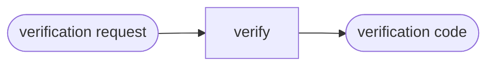

# Verify Payload

## Actions

Run the flow above. Read only the next action file.

| Action | Does |
| --- | --- |
| verify | verify the bundled payload |

## Transversal rules

- Read [01-verify.md](actions/01-verify.md) before answering.
- Leave project files unchanged.
